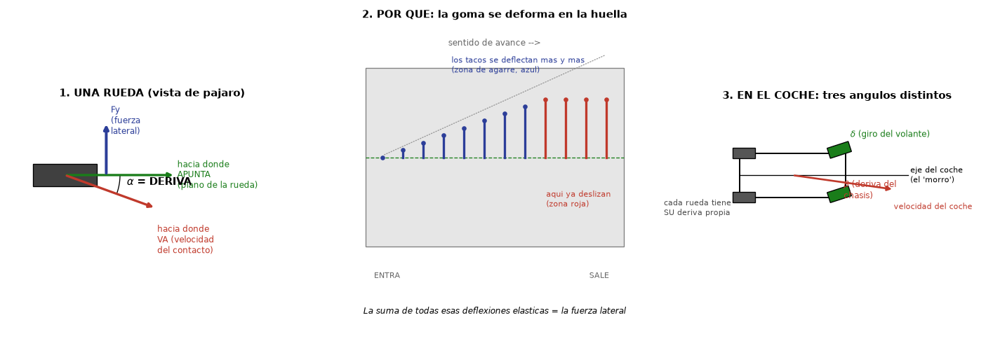
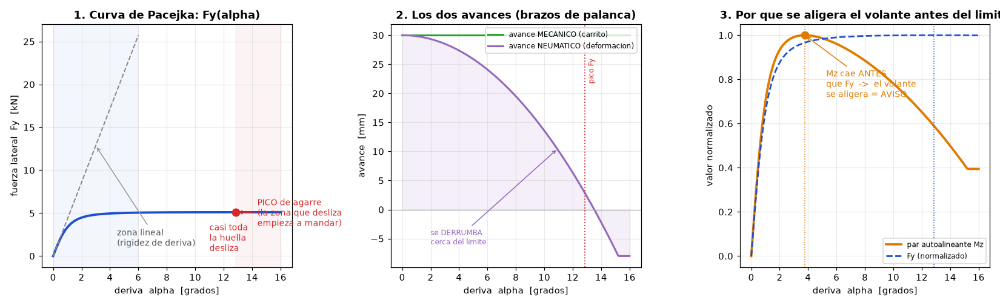
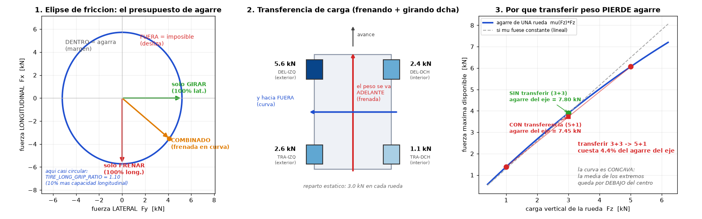

# La física del neumático: deriva, agarre y sensaciones en el volante

> Documento de fundamentos. Explica **por qué** un coche gira, frena y avisa
> antes de perderse, y **dónde** está cada uno de esos efectos en el código
> del simulador. Complementa a [`FISICA.md`](FISICA.md), que describe el
> modelo completo del vehículo; aquí se profundiza en el contacto
> neumático-asfalto, que es donde nace absolutamente todo.

Un coche no tiene más conexión con el mundo que **cuatro huellas de goma del
tamaño de la palma de una mano**. Toda la aceleración, toda la frenada, todo
el giro y toda la información que llega a tus manos pasa por esos cuatro
rectángulos. Entender lo que ocurre dentro de ellos es entender la
conducción entera.

---

## Índice

1. [La deriva: qué es exactamente](#1-la-deriva-qué-es-exactamente)
2. [Los tres ángulos que no hay que confundir](#2-los-tres-ángulos-que-no-hay-que-confundir)
3. [Por qué la deriva genera fuerza: el modelo de cepillo](#3-por-qué-la-deriva-genera-fuerza-el-modelo-de-cepillo)
4. [La curva de Pacejka: pico y caída](#4-la-curva-de-pacejka-pico-y-caída)
5. [El par autoalineante y los dos avances](#5-el-par-autoalineante-y-los-dos-avances)
6. [La caída (camber) y la convergencia (toe)](#6-la-caída-camber-el-ángulo-que-se-pierde-al-tumbarse)
7. [La longitud de relajación: el agarre llega con retraso](#7-la-longitud-de-relajación-el-agarre-llega-con-retraso)
8. [El deslizamiento longitudinal](#8-el-deslizamiento-longitudinal)
9. [El agarre combinado: la elipse de fricción](#9-el-agarre-combinado-la-elipse-de-fricción)
10. [Transferencia de carga y sensibilidad a la carga](#10-transferencia-de-carga-y-sensibilidad-a-la-carga)
11. [Efectos de segundo orden](#11-efectos-de-segundo-orden)
12. [¿Qué está modelizado y dónde?](#12-qué-está-modelizado-y-dónde)
13. [Qué NO está modelizado](#13-qué-no-está-modelizado)
14. [Parámetros ajustables](#14-parámetros-ajustables)

---

## 1. La deriva: qué es exactamente



Coge **una sola rueda** y mírala desde arriba. Hay dos direcciones que no
tienen por qué coincidir:

- **Hacia dónde APUNTA**: el *plano de la rueda*. Es la línea por la que
  rodaría si no hubiera fricción alguna, como una moneda rodando de canto.
- **Hacia dónde VA de verdad**: la *velocidad del centro de la huella de
  contacto*. Es la trayectoria real de ese trozo de goma sobre el asfalto.

El ángulo entre ambas es la **deriva** (en inglés *slip angle*), que se
denota **α**:

```
α = (dirección a la que apunta la rueda) − (dirección en que se mueve su huella)
```

Tres precisiones que evitan el 90 % de los malentendidos:

1. **La deriva se define rueda a rueda.** No es un ángulo del coche. Cada
   una de las cuatro ruedas tiene *su propia* α, y en la práctica las cuatro
   son distintas. Cuando se dice «un neumático no rueda hacia donde apunta»
   se habla del **plano de esa rueda concreta**, no del morro del coche.

2. **La deriva no es un defecto, es el mecanismo.** La fuerza lateral no
   aparece «además de» la deriva: la fuerza lateral **es** consecuencia
   directa de la deriva. Sin deriva no hay fuerza lateral en un neumático.
   Un coche que toma una curva lleva, obligatoriamente, deriva en sus
   cuatro ruedas.

3. **Los valores son pequeños.** Un neumático de calle da su máximo agarre
   en torno a **6-9°** de deriva; uno de competición, en **4-6°**. En
   conducción normal, circulando por una carretera, la deriva anda por
   **0,5-2°**. Son ángulos que no se ven a simple vista: la rueda parece ir
   perfectamente alineada.

> **La analogía de la vela.** Un velero que ciñe no avanza en la dirección
> a la que apunta su quilla: avanza «cangrejeando», con cierto ángulo de
> deriva respecto al agua. Y precisamente ese ángulo es lo que hace que la
> quilla genere el empuje lateral que permite ceñir. Sin deriva, no hay
> empuje. Un neumático funciona exactamente igual.

---

## 2. Los tres ángulos que no hay que confundir

En un coche conviven tres ángulos distintos, y confundirlos lleva a
conclusiones erróneas:

| Símbolo | Nombre | Definido entre... | Quién lo controla |
|---|---|---|---|
| **δ** (delta) | Ángulo de **dirección** | El plano de la rueda delantera y el eje longitudinal del coche | El conductor, con el volante |
| **β** (beta) | **Deriva del chasis** (*body sideslip*) | El eje longitudinal del coche (el «morro») y la velocidad del centro de masas | Resultado de la física |
| **α** (alfa) | **Deriva del neumático** (*slip angle*) | El plano de *cada* rueda y la velocidad de *su* huella | Resultado de la física |

**β** es «cuánto va de lado el coche entero» — el ángulo del morro, lo que
se ve espectacular en un derrape. **α** es «cuánto va de lado cada goma» —
casi invisible, pero es lo que genera las fuerzas.

Ambos están relacionados por geometría. Para una rueda delantera, con
buena aproximación a ángulos pequeños:

```
α_delantera ≈ δ − β − (ψ̇ · l_f) / v
α_trasera   ≈    − β + (ψ̇ · l_r) / v
```

donde `ψ̇` es la velocidad de guiñada (el coche rotando sobre sí mismo),
`l_f` y `l_r` las distancias del centro de gravedad a los ejes delantero y
trasero, y `v` la velocidad.

De estas dos ecuaciones sale **el concepto más importante de la dinámica
vehicular**:

- Si **α_delantera se satura antes** que la trasera, el eje delantero deja
  de poder generar más fuerza lateral aunque gires más volante. El coche se
  va recto: **SUBVIRAJE**.
- Si **α_trasera se satura antes**, es la cola la que pierde. El coche gira
  más de lo pedido: **SOBREVIRAJE**.

Todo el reglaje de un coche —barras estabilizadoras, muelles, presiones,
alerones, reparto de frenada— consiste en gobernar **cuál de los dos ejes
llega antes a su pico de deriva**.

En el simulador esto se calcula explícitamente en
`simulator/physics.py:784-805`, normalizando la deriva de cada eje por el
pico (`TIRE_PEAK_SLIP_ANGLE_DEG`) y comparando: el eje que va más «pasado
de pico» marca la tendencia, y esa señal alimenta el chirrido de neumáticos
y los avisos en pantalla.

---

## 3. Por qué la deriva genera fuerza: el modelo de cepillo

Aquí es donde la intuición engaña. Uno imagina el neumático como un sólido
rígido, pero **la banda de rodadura es goma elástica**: un cepillo de tacos
que se deforman.

### El recorrido de un taco por la huella

Sigue un taco de goma desde que entra en la huella hasta que sale (panel 2
de la figura anterior):

1. **Entra** por delante de la huella y se «pega» al asfalto por rozamiento
   estático. Ese punto queda quieto respecto al suelo.
2. Pero la **carcasa** de la rueda sigue avanzando en la dirección a la que
   apunta el plano de la rueda, mientras el punto pegado se queda donde
   tocó. Como la rueda va ligeramente «de lado» respecto a su plano, el taco
   **se va estirando lateralmente**, cada vez más, a medida que recorre la
   huella.
3. Ese estiramiento es **un muelle deformado**. Y un muelle deformado es una
   fuerza. La suma de las fuerzas de todos los tacos estirados **es** la
   fuerza lateral del neumático.
4. Al final de la huella el estirón es tan grande que la fuerza elástica
   supera al rozamiento disponible, y el taco **desliza** de golpe para
   recolocarse antes de despegarse.

Así que la huella tiene siempre **dos zonas**: una delantera **de agarre**
(los tacos están pegados y estirándose) y una trasera **de deslizamiento**
(los tacos ya patinan).

### Consecuencia importante: SIEMPRE hay deslizamiento parcial

Esto merece énfasis porque suele malentenderse: **la zona de deslizamiento
existe para cualquier deriva mayor que cero**, no sólo cerca del límite. Lo
que cambia con α es *qué fracción* de la huella desliza:

| Deriva | Zona de agarre | Zona de deslizamiento | Sensación |
|---|---|---|---|
| α ≈ 0,5° | ~99 % | ~1 % | Va «clavado» |
| α ≈ 3° | ~80 % | ~20 % | Curva normal, el coche carga |
| α ≈ 7° (pico) | ~45 % | ~55 % | Al límite, chirrido incipiente |
| α ≈ 12° | ~10 % | ~90 % | El eje se ha ido |

El **pico de agarre** es justamente el punto donde la ganancia por estirar
más los tacos de la zona de agarre queda compensada por la pérdida de área
que ya desliza. A partir de ahí, más deriva significa **menos** fuerza.

### ¿Y si el neumático fuese perfectamente rígido?

Pregunta legítima y muy aclaratoria. **Sí tendría reacción por rozamiento.**
Un cuerpo perfectamente rígido apoyado en el suelo puede transmitir fuerza
lateral por **rozamiento estático** con deriva **exactamente cero**: el
rozamiento estático entrega la fuerza que le pidas, hasta el tope μ·N, sin
necesidad de que haya movimiento relativo.

La diferencia está en el **carácter** de esa fuerza:

|  | Sólido rígido ideal | Neumático elástico real |
|---|---|---|
| Fuerza vs. deriva | **Interruptor**: todo o nada | **Muelle**: progresiva |
| A α = 0 | Puede dar hasta μ·N | Da exactamente 0 |
| Al superar el límite | Desliza de golpe, la fuerza cae bruscamente | La fuerza cae suavemente pasado el pico |
| Aviso previo | Ninguno | Par autoalineante, ruido, respuesta |
| Resistencia a la rodadura | Cero | Existe (histéresis de la goma) |

Es decir: **la deformación no es lo que permite que haya fuerza — el
rozamiento la permitiría igual. La deformación es lo que hace que la fuerza
sea graduable, progresiva y comunicativa.** Sin esa elasticidad no
existirían ni la zona lineal, ni el par autoalineante progresivo, ni la
longitud de relajación, ni nada de lo que llamamos «tacto». Conducir sobre
ruedas perfectamente rígidas sería como pilotar sobre hielo con topes:
agarra, agarra, agarra... y de repente, nada.

La frase «sin deriva no hay fuerza lateral» es, por tanto, una propiedad
**del neumático elástico**, no una ley universal del rozamiento.

---

## 4. La curva de Pacejka: pico y caída



Si se junta el modelo de cepillo con α creciente, la curva fuerza-deriva
sale sola (panel 1 de la figura):

### Zona lineal

Con α pequeño la huella agarra casi entera, y cada grado adicional aporta
fuerza en proporción. La pendiente en el origen es la **rigidez de deriva**
(*cornering stiffness*), medida en N por grado o N/rad:

```
C_α = ∂F_y / ∂α  |_(α=0)
```

Es el parámetro más importante para el comportamiento en conducción normal:
un neumático con `C_α` alta (flancos rígidos, perfil bajo) responde nervioso
al primer toque de volante; uno con `C_α` baja (perfil alto, blando) responde
perezoso. Es la diferencia de tacto entre un deportivo y un todoterreno,
mucho antes de acercarse a ningún límite.

### El codo y el pico

Al crecer α, la zona deslizante trasera avanza y empieza a comerse la
ganancia. La curva se dobla y alcanza el **pico de agarre**, típicamente en
6-9° para calle y 4-6° para competición. Ese pico vale aproximadamente
**μ·F_z**.

### La caída

Pasado el pico, casi toda la huella desliza y la fuerza baja. Cuánto baja
depende del neumático: los de competición caen **bruscamente** (por eso son
difíciles: castigan el error), los de calle caen **suavemente** (por eso
perdonan). En el simulador, la caída se ajusta con `TIRE_C`, y llega a
aproximadamente el 80 % del pico.

### La Magic Formula

La ecuación empírica estándar del sector, debida a Hans Pacejka, es:

```
F_y = D · sin( C · atan( B·α − E·(B·α − atan(B·α)) ) )
```

donde:

- **D** = valor de pico (≈ μ·F_z)
- **B** = factor de rigidez (gobierna la pendiente inicial)
- **C** = factor de forma (gobierna cuánto cae después del pico)
- **E** = factor de curvatura (afina la zona del codo)

No es una deducción teórica elegante, sino la **fórmula empírica con la que
la industria ajusta datos reales de banco de ensayo**. Se le llama «mágica»
precisamente porque no se deriva de primeros principios: se ajusta. Y ajusta
extraordinariamente bien.

En el simulador está en `simulator/physics.py:61-65`, en su versión
**combinada** (una sola curva para el deslizamiento total, ver §9):

```python
def tire_force_magnitude(rho, mu, fz):
    return mu * fz * math.sin(cfg.TIRE_C * math.atan(cfg.TIRE_B * rho))
```

con `TIRE_B = 2.07`, `TIRE_C = 1.4` en `simulator/config.py:183-184`, y el
pico situado en `rho = 1`.

> **Modelo seleccionable (`TIRE_MODEL`).** Lo anterior —una sola forma de
> curva (`B`, `C`) compartida por el eje longitudinal y el lateral— es el modo
> `legacy`. En el modo `brush` cada eje tiene **su propia forma**
> (`TIRE_B_LONG/C_LONG` y `TIRE_B_LAT/C_LAT`) y la mezcla se interpola según la
> dirección del deslizamiento (§9): la longitudinal queda más rígida y con
> pico más marcado (límite de tracción/frenada más nítido) y la lateral más
> progresiva y con caída más suave (entrada avisada). En rigor es un **modelo
> híbrido de deslizamiento independiente** (curvas separadas + mezcla
> direccional + elipse), no un *brush model* que reparta la tensión cortante
> en la huella. Las curvas reales de ambos modos, con los valores de
> `config.py`, están dibujadas en `docs/img/curvas_neumatico.png`.

---

## 5. El par autoalineante y los dos avances

La rueda no sólo empuja lateralmente: también **gira sobre su propio pivote
de dirección**, y ese par es lo que llega a tus manos a través del volante.
Se llama **par autoalineante** (`M_z`), y tiene **dos orígenes que se suman**.

### 5.1 Avance mecánico (*mechanical trail*) — el efecto carrito

Es **pura geometría de suspensión**. El eje de dirección (la línea que une
las rótulas de la mangueta) no es vertical: está **inclinado hacia atrás**
por el llamado **ángulo de avance** o *caster*. Al prolongar ese eje hasta
el suelo, el punto donde corta queda **por delante** del punto de contacto
del neumático. Esa distancia es el avance mecánico.

Como la fuerza lateral se aplica por **detrás** del punto de pivote, se
genera un par que tiende a **alinear la rueda con la dirección de avance**.

Es exactamente el mecanismo de las ruedas locas de un carrito de la compra
o de una silla de oficina: la rueda arrastra por detrás de su pivote, y por
eso se autoalinea sola al empujar. **Este efecto existe incluso con una
rueda perfectamente rígida** — es geometría, no elasticidad. Es lo que hace
que puedas soltar el volante saliendo de una curva y el coche se enderece
solo.

Valores típicos: **20-40 mm** en un turismo.

### 5.2 Avance neumático (*pneumatic trail*) — el efecto de la deformación

Este sí nace del modelo de cepillo. Como la zona delantera de la huella es
la que agarra y la trasera desliza, **la resultante de la fuerza lateral no
está en el centro de la huella, sino desplazada hacia atrás**. Ese
desplazamiento es un brazo de palanca adicional que se suma al mecánico.

Valores típicos: **20-35 mm** con deriva pequeña.

### 5.3 La suma, y por qué el volante avisa

```
M_z = F_y · ( t_mecánico + t_neumático )
```

La clave está en cómo evoluciona cada uno con la deriva (panel 2 de la
figura):

- El **avance mecánico es prácticamente constante**: es geometría, no
  depende de cuánto desliza la goma.
- El **avance neumático se derrumba** al crecer α: cuando la zona trasera de
  la huella deja de agarrar del todo, la resultante **se adelanta** hasta el
  centro, e incluso más allá (el avance neumático puede llegar a hacerse
  **negativo**).

Consecuencia, y es una de las cosas más bonitas de la dinámica vehicular
(panel 3 de la figura): **el par autoalineante alcanza su máximo ANTES que
la fuerza lateral**. Traducido a tus manos:

1. Al empezar a girar, el volante **pesa cada vez más**: estás cargando el
   eje delantero.
2. Antes de llegar al agarre máximo, el volante **se aligera ligeramente**:
   es el avance neumático derrumbándose.
3. Ese aligeramiento es un **aviso anticipado de subviraje**: te dice
   «estás en el codo de la curva de Pacejka, no pidas más». Y llega
   *antes* de perder el eje.
4. Cuando el eje ya se ha ido, sólo queda el avance mecánico: el volante
   queda ligero pero no muerto.

Medido en el simulador con el DEPORTIVO de serie: **el par pica a 3,9° de
deriva, cuando el agarre pica a 7°**, y cae un 35 % hasta la saturación. El
aviso llega, por tanto, con casi la mitad del recorrido de deriva por
delante — tiempo de sobra para corregir.

Los buenos pilotos conducen escuchando exactamente ese punto. Y un
simulador que no reproduzca este detalle se siente «sordo» aunque las
fuerzas sean correctas.

### 5.4 Caída ganada al girar (*caster camber gain*)

El caster tiene un **segundo efecto**, y es la verdadera razón de que los
coches de competición monten tanto: al pivotar la rueda sobre un eje
**inclinado hacia atrás**, girar el volante **inclina la rueda**.

Y lo hace en el sentido bueno: la rueda **exterior** de la curva (la que
lleva la carga) gana **caída negativa**, es decir se tumba **hacia dentro**
de la curva, empujando a favor del giro. La interior, que apenas está
cargada, se tumba hacia fuera.

```
Δcaída ≈ ∓ sin(caster) · δ        (− para la rueda exterior)
```

Es **caída negativa gratis justo cuando hace falta**, sin penalizar la
huella en recta —al contrario que la caída estática, que desgasta el
neumático por dentro y reduce la tracción en línea recta—. Esa es la
diferencia clave, y por eso un fórmula monta 10-14° de avance mientras un
utilitario se conforma con 2-3°.

El compromiso: **más caster = volante más pesado**, porque el brazo de
palanca crece. En un coche sin dirección asistida es el límite práctico.

### 5.5 Cómo está en el simulador

Los dos avances son **independientes**, cada uno con su propia función.

**Avance neumático** (`simulator/physics.py`, `pneumatic_trail`) — nace de la
deformación, cae con la deriva y llega a hacerse negativo:

```python
def pneumatic_trail(alpha):
    sat = math.radians(cfg.TIRE_TRAIL_SAT_DEG)          # 7,0 grados
    t = cfg.TIRE_TRAIL * (1.0 - abs(alpha) / sat)       # TIRE_TRAIL = 30 mm
    return max(-cfg.TIRE_TRAIL_NEG_FRAC * cfg.TIRE_TRAIL, t)
```

**Avance mecánico** (`mechanical_trail`) — geometría pura del caster,
constante con la deriva:

```python
def mechanical_trail(radius):
    return radius * math.tan(math.radians(cfg.CASTER_ANGLE_DEG)) \
        + cfg.STEER_TRAIL_OFFSET
```

**Caída ganada al girar** (`caster_camber`), que entra en el mismo término de
empuje por caída que el balanceo:

```python
def caster_camber(delta, side):
    return -side * math.sin(math.radians(cfg.CASTER_ANGLE_DEG)) * delta \
        * cfg.CASTER_CAMBER_GAIN
```

Y se suman en el par de columna:

```python
for i in (FL, FR):
    trail = pneumatic_trail(st.slip_angle[i]) + mechanical_trail(R_w[i])
    mz += -fy_w[i] * trail
```

Tres consecuencias de que `t_mec` dependa del **radio**:

1. El **catálogo de ruedas queda acoplado a la dirección**: montar una rueda
   más grande alarga el brazo y **endurece el volante**. Es real y ahora sale
   solo, sin ningún parámetro añadido.
2. Con ruedas **escalonadas** (*staggered*), sólo cuenta el radio delantero,
   que es el correcto.
3. El caster es ya un **parámetro de reglaje por coche** (`CASTER_ANGLE_DEG`
   en cada `.car`), no una constante global.

#### Valores resultantes con el reglaje de serie del DEPORTIVO

Caster 6°, rueda 225/40R18 (R = 318 mm) → `t_mec` = 33,6 mm:

| Deriva | t_neumático | t_mecánico | **Total** |
|---:|---:|---:|---:|
| 0° | 30,0 mm | 33,6 mm | **63,6 mm** |
| 3° | 17,1 mm | 33,6 mm | **50,7 mm** |
| 5° | 8,6 mm | 33,6 mm | **42,2 mm** |
| 7° (pico de agarre) | 0,0 mm | 33,6 mm | **33,6 mm** |
| 12° (saturado) | −5,4 mm | 33,6 mm | **28,2 mm** |

Medido en el simulador con un barrido de volante real, el par de columna
**pica a 3,9° de deriva** (el agarre pica a 7°) y **cae un 35 %** hasta la
saturación. Antes de separar los avances caía un 71 %: era el doble de
dramático que un coche real, porque el avance mecánico estaba puesto en
6,75 mm cuando el valor físico son 20-40 mm.

> **Nota de calibración.** Al hacerlo físico, el par de columna que entrega
> la física subió un ~88 %. Para que el volante siga sintiéndose igual de
> duro, `FFB_MAX_TORQUE_NM` pasó de 35 a **66 N·m**: la relación
> pico/saturación se mantiene en 0,73, exactamente la de antes. Lo que
> cambia no es el peso del volante, sino **la forma de la curva**.

### 5.6 Radio de pivotamiento (*scrub radius*)

Lo que sí está modelizado aparte es el **radio de pivotamiento**: la
distancia lateral entre el eje de dirección y el centro de la huella. Hace
que las **fuerzas longitudinales** (frenada, tracción) también tiren del
volante. En `simulator/physics.py:815`:

```python
mz += (fx_w[FL] - fx_w[FR]) * cfg.STEER_SCRUB_RADIUS   # 0,04 m
```

Es lo que produce:

- El **torque steer** de un tracción delantera potente (el volante tira al
  acelerar).
- El **tirón al frenar** con las ruedas de un lado sobre superficie
  distinta (μ-split: dos ruedas en el arcén o en hierba).
- La **pulsación del ABS** que se nota en las manos, porque las dos ruedas
  delanteras no modulan exactamente a la vez.

---

## 6. La caída (camber): el ángulo que se pierde al tumbarse

Si la deriva es cuánto va de lado una rueda, **la caída es cuánto va
tumbada**: el ángulo entre el plano de la rueda y la vertical, visto de
frente.

Por convenio, **caída NEGATIVA** significa que la rueda «abraza» al coche —
la parte de arriba se inclina hacia el centro del vehículo. Es la que se ve
en cualquier coche de circuito y en un turismo cargado en curva.

### 6.1 Las cuatro caídas que se suman

Lo importante, y lo que más se malinterpreta: **lo único que le importa al
neumático es su ángulo CONTRA EL ASFALTO**, no cada aportación por separado.
Y ese ángulo es la suma de cuatro cosas (`simulator/physics.py`):

```python
lean = side * gamma_estatica          # 1. reglaje de alineación
       - st.roll                      # 2. balanceo de la carrocería
       - side * SUSP_CAMBER_GAIN * susp_def[i]   # 3. camber gain
if i < 2:
    lean += caster_camber(delta, side)           # 4. caster (eje directriz)
```

1. **Caída estática** (`STATIC_CAMBER_FRONT_DEG` / `_REAR_DEG`): la del
   reglaje de alineación, la que lleva el coche parado. Es lo que se ajusta
   en una mesa de alineación.
2. **Balanceo**: en curva la carrocería se tumba hacia **fuera** y arrastra
   consigo a las ruedas, **deshaciendo** la caída estática.
3. **Camber gain** (`SUSP_CAMBER_GAIN`): al comprimirse, la geometría de
   suspensión devuelve caída negativa. Un paralelogramo deformable la
   recupera bien; un eje rígido, nada.
4. **Caster** (solo el eje directriz): la ganada al girar, §5.4.

### 6.2 Para qué sirve la caída estática

Aquí está la idea entera: **se pone caída negativa estática precisamente
para que la rueda EXTERIOR quede plana cuando la carrocería se tumbe.**

Es un pago por adelantado. En recta la rueda va inclinada (y eso cuesta), a
cambio de que en el apoyo —donde se juega el agarre— quede apoyando de
lleno. Medido en el simulador con el DEPORTIVO, aislando el caster:

| Caída estática | Caída de la rueda exterior en curva |
|---:|---:|
| 0° | **1,93°** (rodando sobre el hombro exterior) |
| −2° | **0,04°** (apoya plana) |

### 6.3 El efecto en la huella, y el óptimo

Una rueda inclinada **no apoya plana**: la carga se concentra en un hombro,
la huella efectiva se reduce y el agarre disponible baja. La pérdida es
**cuadrática** (`TIRE_CAMBER_PATCH`), y eso importa mucho:

| Inclinación contra el asfalto | Agarre perdido |
|---:|---:|
| 1° | 0,5 % |
| 2° | 2,2 % |
| 3° | 4,9 % |
| 5° | 13,7 % |

Un grado no se nota; cinco arruinan el neumático. Y aquí está **la clave de
por qué existe un óptimo de reglaje**:

- El **empuje por caída** (*camber thrust*, §6.4) crece **linealmente** con
  la inclinación.
- La **pérdida de huella** crece **cuadráticamente**.

Para inclinaciones pequeñas gana el empuje (aporta más de lo poco que cuesta
la huella); pasado cierto punto manda la huella y todo lo que añadas resta.
Ese equilibrio cae en torno a **1° de caída contra el asfalto en la rueda
cargada**, que es exactamente lo que persigue un ingeniero de pista.

> Si la pérdida de huella fuese **lineal** en vez de cuadrática, el modelo
> diría que el neumático siempre quiere apoyar perfectamente plano, y no
> existiría ningún óptimo. Es un detalle de modelización que cambia por
> completo el comportamiento del reglaje.

De ahí sale el compromiso completo, que el simulador reproduce:

| | Con caída estática | Sin ella |
|---|---|---|
| En **recta** (frenar, acelerar) | Peor: la rueda va inclinada | Mejor: apoya plana |
| En **curva** | Mejor: el balanceo la endereza | Peor: rueda sobre el hombro |
| **Desgaste** | Se come el hombro interior | Parejo |
| **Temperatura** | Sube antes (`TIRE_CAMBER_HEAT`) | Normal |

Medido en el simulador: **−4° de caída estática alargan la frenada de 100 a
0 km/h de 35,1 m a 41,3 m** (+18 %). Es el precio real de un reglaje de
circuito en un coche que hace kilómetros de autopista.

### 6.4 Empuje por caída (*camber thrust*)

Una rueda inclinada genera fuerza lateral **hacia el lado al que se tumba**
aunque su deriva sea cero — es el mecanismo con el que gira una motocicleta,
que no tiene apenas deriva sino que se tumba.

En un coche, al balancearse la carrocería las ruedas se tumban hacia
**fuera** de la curva, así que este empuje **resta** agarre lateral. Por eso
un vehículo alto y blando subvira mucho más apoyado que uno rígido.

`fy += TIRE_CAMBER_THRUST · lean · fz`

Nótese que **el empuje y la pérdida de huella son efectos distintos que
conviven**: el primero añade fuerza lateral en una dirección concreta, el
segundo recorta la capacidad de fricción en todas.

### 6.5 Por qué un todoterreno agarra mal en curva

Con todo lo anterior, el simulador explica solo un comportamiento conocido.
Caída de la rueda **exterior** al límite, medida con cada coche en su propia
curva:

| Coche | Estática | Camber gain | Balanceo | **Exterior en curva** |
|---|---:|---:|---:|---:|
| DEPORTIVO | −1,5° | 0,45 | 2,9° | **+0,03°** (plana) |
| GT ITALIANO | −3,0° | 0,55 | 2,4° | **+2,19°** (tumbada hacia dentro) |
| FÓRMULA | −3,5° | 0,65 | 4,2° | **−0,02°** (plana) |
| RALLY | −2,0° | 0,40 | 3,3° | **+0,03°** (plana) |
| BERLINA | −0,8° | 0,30 | 4,7° | **−2,28°** |
| UTILITARIO | −0,5° | 0,25 | 4,1° | **−2,69°** |
| AUTOBÚS | 0,0° | 0,00 | 3,1° | **−2,72°** |
| TODOTERRENO | −0,3° | 0,10 | 5,0° | **−4,04°** |

Los coches de prestaciones llegan a la curva con la rueda **plana o
ligeramente tumbada hacia dentro**: máximo agarre. Los altos y blandos
llegan con la rueda **volcada sobre el hombro exterior**, perdiendo huella
justo cuando más la necesitan. No es un parámetro de castigo puesto a mano:
sale de que ruedan mucho (5°) y su suspensión apenas recupera caída.

Es también la razón física de que a un todoterreno le siente tan bien
rebajar el centro de gravedad o endurecer las barras: no es solo «vuelca
menos», es que **su goma vuelve a apoyar plana**.

> **Nota de calibración.** Al introducir la caída estática se vio que los
> `SUSP_CAMBER_GAIN` de toda la flota estaban 2-3 veces por encima de lo
> real (1,2 rad/m en el GT recuperaba 1,8°, cuando un GT3 recupera del orden
> de 0,5-0,8°/pulgada ≈ 0,55 rad/m). Sin caída estática con la que
> compararlos, el desajuste no se notaba. Están recalibrados.

### 6.6 Convergencia (*toe*): el tercer ángulo de la alineación

Con el avance (§5) y la caída (§6) queda el tercero de la mesa de
alineación. La **convergencia** es cuánto apunta cada rueda hacia dentro o
hacia fuera, vista desde arriba:

- **Convergencia** (*toe-in*, positiva): las ruedas apuntan **hacia
  dentro**. Da estabilidad en recta.
- **Divergencia** (*toe-out*, negativa): apuntan hacia fuera. **Afila la
  entrada en curva**, porque la rueda exterior llega ya girada hacia ella.

El mecanismo es directo: cada rueda arranca con una deriva de partida, de
signo opuesto en cada lado. Medido en el simulador con 0,4° de
convergencia delantera, en recta: **rueda izquierda −0,40°, derecha
+0,40°**. Las dos generan fuerza lateral hacia dentro y **se anulan**.

De ahí sale todo lo demás:

| | Efecto |
|---|---|
| **En recta** | Las dos fuerzas se cancelan, pero el **arrastre no**: cuesta velocidad punta y desgasta la goma |
| **Ante una perturbación** | Si el coche se desvía, una rueda gana carga y su fuerza deja de estar compensada: aparece una fuerza **restauradora**. Eso es la estabilidad |
| **Al entrar en curva** | Con divergencia, la rueda exterior (la que va a cargarse) ya apunta a la curva: el coche gira antes |
| **Convergencia trasera** | Es lo que **impide que la cola se mueva sola** al levantar el pie. Medido: pasar de −0,3° a +0,4° reduce el pico de guiñada al soltar gas |

Por eso un turismo lleva convergencia en los dos ejes (estabilidad y
seguridad) y un coche de circuito suele llevar **divergencia delante** y
**convergencia detrás**: entra afilado pero con la cola sujeta.

En el simulador, `TOE_FRONT_DEG` y `TOE_REAR_DEG` entran en el ángulo real
de cada rueda, junto con la dirección:

```python
d_w[i] = (delta si es eje directriz, si no 0) − lado · convergencia
```

Nótese que **las cuatro ruedas** pueden ir giradas: antes solo las
delanteras tenían ángulo propio.

---

## 7. La longitud de relajación: el agarre llega con retraso

La fuerza lateral **no aparece en el instante** en que giras el volante. La
goma necesita **rodar un cierto trecho** para construir el estirón de tacos
descrito en §3. Ese trecho es la **longitud de relajación**, σ.

Valores típicos: **0,3 - 0,7 m** — del orden del radio de la rueda.

Lo esencial es que se trata de un retardo **en el espacio, no en el
tiempo**:

```
σ · dF_y/ds + F_y = F_y,objetivo(α)
```

Consecuencias que se notan al conducir:

- A **baja velocidad**, esos 0,3 m se recorren enseguida: la fuerza aparece
  casi instantánea y la dirección se siente clavada.
- A **alta velocidad**, la misma distancia se recorre en muy poco tiempo,
  pero si haces un **cambio de dirección rápido** (una chicane, un latigazo
  de volante para esquivar), la fuerza **llega con un retraso perceptible**
  respecto a lo que pides. Es lo que da la sensación de que el coche «carga»
  el eje progresivamente en vez de responder de golpe.
- **Filtra el ruido**: baches y microirregularidades no se transmiten como
  picos secos, porque la goma los promedia a lo largo de esa longitud.
- Es una de las causas de la **oscilación amortiguada** al soltar el volante
  bruscamente.

En el simulador, `simulator/physics.py:626-628`:

```python
blend = min(1.0, (vx_abs + 0.5) * dt / cfg.TIRE_RELAX_LENGTH)
self._fy_state[i] += (fy_ss - self._fy_state[i]) * blend
```

Fíjate en que el paso del filtro es `v·dt / σ`, es decir **distancia
recorrida partida por longitud de relajación**: a más velocidad, el retardo
*temporal* se acorta, pero el *espacial* se mantiene — exactamente como en
la realidad. `TIRE_RELAX_LENGTH = 0.3 m` (`config.py:206`).

---

## 8. El deslizamiento longitudinal

Todo lo anterior tiene su gemelo en la dirección de avance. El
**deslizamiento longitudinal** (*slip ratio*) mide la discrepancia entre la
velocidad periférica de la rueda y la velocidad real del coche:

```
s = (ω·R − v) / |v|
```

- `s = 0`: rodadura pura, la rueda gira exactamente lo que avanza.
- `s > 0`: la rueda gira **más** de lo que avanza → **tracción** (patina si
  es mucho).
- `s < 0`: la rueda gira **menos** → **frenada** (bloqueo si llega a −1).

El mecanismo microscópico es idéntico al de la deriva: los tacos se
deforman **longitudinalmente** en la huella, y la suma de esas deformaciones
es la fuerza. Y la curva fuerza-deslizamiento tiene la misma forma: zona
lineal, pico y caída.

El pico está típicamente en **s ≈ 0,10-0,15** (`TIRE_PEAK_SLIP_RATIO = 0.12`
en `config.py:188`). De ahí nace todo:

- El **ABS** existe para mantener el deslizamiento en el entorno del pico
  (`ABS_SLIP_TARGET`), porque una **rueda bloqueada frena peor** que una al
  límite — está en la parte caída de la curva. Además, una rueda bloqueada
  tiene deriva indefinida y **no puede dirigir**.
- El **control de tracción** hace lo mismo al acelerar.
- El **launch control** de un deportivo busca exactamente ese `s` óptimo.

En el simulador se calcula en `physics.py:591` y el ABS modula en
`physics.py:556-573`.

---

## 9. El agarre combinado: la elipse de fricción



Aquí está una de las leyes más importantes de la conducción, y la razón por
la que no se puede frenar a tope y girar a tope simultáneamente.

### El presupuesto de agarre

Un neumático tiene una **capacidad total** de fuerza en el plano del suelo,
aproximadamente **μ·F_z**, y esa capacidad **se reparte** entre la dirección
longitudinal (acelerar/frenar) y la lateral (girar). No se suman: **compiten
por el mismo presupuesto**.

La condición es:

```
( F_x / F_x,max )² + ( F_y / F_y,max )² ≤ 1
```

Es la ecuación de una **elipse** (panel 1 de la figura). Todo lo que caiga
**dentro** de la elipse, el neumático lo puede dar. Todo lo que caiga
**fuera**, es físicamente imposible: la goma desliza.

Se le llama elipse y no círculo porque en general la capacidad longitudinal
es algo mayor que la lateral, por la forma rectangular de la huella y la
construcción del neumático. En este simulador el factor es
`TIRE_LONG_GRIP_RATIO = 1.10` (`config.py:204`), es decir **un 10 % más de
capacidad longitudinal** — una elipse muy poco excéntrica, casi un círculo.

### Lo que implica al conducir

- **100 % de frenada** → 0 % de capacidad para girar. Frenar a tope con las
  ruedas al límite y pretender esquivar algo es imposible: no queda
  presupuesto lateral. (Con ABS sí queda, porque el ABS deja algo de margen
  precisamente para poder dirigir.)
- **100 % de giro** → 0 % de capacidad para frenar o acelerar. Si estás al
  límite de agarre lateral en el ápice y pisas el freno, pierdes el eje.
- **Trail braking**: la técnica de soltar el freno *progresivamente* mientras
  se aumenta el ángulo de volante consiste, literalmente, en **recorrer el
  borde de la elipse**: intercambiar capacidad longitudinal por lateral sin
  salirse nunca del contorno. Cambiar de un vector al otro pasando por el
  interior del contorno es lento; pasar por el borde es la vuelta rápida.
- **Levantar el pie en curva** (*lift-off oversteer*): al soltar gas de
  golpe en un tracción trasera, se transfiere peso al eje delantero y el
  trasero pierde capacidad total; con la lateral ya al límite, la cola se
  va.

### Cómo está en el simulador

En `simulator/physics.py:598-611`, y es una implementación elegante:
en lugar de dos curvas separadas, se **normaliza cada deslizamiento por su
pico**, se compone el **deslizamiento total** `rho` y se evalúa **una sola
curva de Pacejka**, repartiendo la fuerza resultante en la dirección del
vector de deslizamiento:

```python
ratio_l = cfg.TIRE_LONG_GRIP_RATIO
s_n = slip / peak_s          # deslizamiento longitudinal normalizado
a_n = alpha / peak_a         # deriva normalizada
s_e = s_n / ratio_l          # escalado -> convierte la elipse en círculo
rho = math.hypot(s_e, a_n)   # deslizamiento COMBINADO
f_total = tire_force_magnitude(rho, mu_i, st.fz[i])
fx     =  f_total * (s_e / rho) * ratio_l
fy_ss  = -f_total * (a_n / rho)
```

El truco del escalado `s_e = s_n / ratio_l` es lo que **convierte la elipse
en un círculo** en el espacio normalizado, permitiendo usar una sola curva
escalar; al devolver la fuerza se deshace el escalado con el `* ratio_l`.
Es exactamente el planteamiento del modelo de deslizamiento combinado
estándar, y garantiza que la transición entre frenar, girar y acelerar sea
continua y físicamente coherente.

Con `TIRE_MODEL = "brush"` (§4) el único cambio es que `B` y `C` dejan de ser
constantes: se interpolan según cuánto del deslizamiento combinado es
longitudinal frente a lateral (`w = s_e²/ρ²`), de modo que un bloqueo de
frenada ve la curva longitudinal (más rígida) y una curva sostenida ve la
lateral (más progresiva), sin romper la continuidad de la elipse.

---

## 10. Transferencia de carga y sensibilidad a la carga

### 9.1 La transferencia

Cuando el coche acelera, frena o gira, las fuerzas de los neumáticos actúan
**a nivel del suelo**, mientras la inercia del coche actúa en el **centro de
gravedad**, que está a una altura `h`. Ese desfase vertical genera un
momento que **redistribuye la carga entre ruedas** (panel 2 de la figura):

```
ΔF_z,longitudinal = m · a_x · h / batalla
ΔF_z,lateral      = m · a_y · h / vía
```

Con un coche de 1.200 kg, `h = 0,52 m`, batalla 2,6 m y una frenada de
1,0 g, se transfieren unos **2.400 N** del eje trasero al delantero: cada
rueda delantera gana ~1,2 kN y cada trasera los pierde. Es una fracción
enorme de la carga estática, y explica por qué:

- La frenada la hace mayoritariamente el eje delantero (de ahí los discos
  grandes delante).
- La rueda **interior trasera** de un coche muy apoyado puede llegar a
  **despegarse** del suelo.
- Un coche **alto** (todoterreno, autobús: `h` grande) transfiere mucho más
  y por eso es torpe, se tumba y subvira apoyado.
- Un **fórmula** (`h` ≈ 0,25 m) transfiere la mitad y por eso mantiene las
  cuatro ruedas trabajando de forma mucho más pareja.

### 9.2 Por qué transferir peso HACE PERDER agarre

Éste es el punto no evidente, y es el fundamento de todo el reglaje de
chasis.

Si el coeficiente de rozamiento μ fuera constante, la fuerza máxima de una
rueda sería `μ·F_z`, una **recta**. Al transferir carga, una rueda ganaría
exactamente lo que la otra pierde, y el agarre total del eje **no
cambiaría**.

Pero μ **no es constante**: **cae al aumentar la carga**. Se llama
**sensibilidad a la carga** (*load sensitivity*), y físicamente ocurre
porque al apretar más el neumático la huella crece menos que
proporcionalmente y la presión de contacto sube, lo que reduce el
rendimiento de la goma.

```
μ(F_z) = μ_0 · [ 1 − k · (F_z − F_z,ref) / F_z,ref ]
```

Al ser μ decreciente, la curva `μ(F_z)·F_z` es **cóncava** (panel 3 de la
figura). Y para una función cóncava, la media de los extremos queda **por
debajo** del valor en el centro:

```
½·[ g(F_z+Δ) + g(F_z−Δ) ]  <  g(F_z)
```

**Conclusión: un eje con las dos ruedas cargadas por igual agarra MÁS que
el mismo eje con la carga desequilibrada.** Con los valores del simulador
(`TIRE_LOAD_SENS = 0.10`), pasar de un reparto 3+3 kN a uno 5+1 kN cuesta un
**4,4 %** del agarre del eje. Parece poco, pero es exactamente el margen en
el que se decide una vuelta rápida... y es el mecanismo por el que funciona
**todo el reglaje**:

- **Barras estabilizadoras**: una barra más dura en un eje hace que **ese
  eje** absorba más transferencia lateral, con lo que **pierde** agarre
  relativo. Endurecer la delantera → más subviraje. Endurecer la trasera →
  más sobreviraje. La barra no cambia la transferencia *total* (ésa la fija
  `m·a_y·h/vía`), sólo **cómo se reparte entre ejes**.
- **Muelles y amortiguadores**: lo mismo, pero además gobernando la
  *velocidad* a la que se transfiere (de ahí que los amortiguadores afecten
  al comportamiento transitorio, no al estacionario).
- **Bajar el centro de gravedad**: reduce la transferencia total. Es la
  mejora que nunca tiene contrapartida.
- **Vía más ancha**: mismo efecto, reduce la transferencia lateral.

### 9.3 Cómo está en el simulador

La sensibilidad a la carga está en `simulator/physics.py:68-76`:

```python
def mu_with_load(mu_base, fz, fz_ref, ls_scale=1.0):
    factor = 1.0 - cfg.TIRE_LOAD_SENS * ls_scale * (fz - fz_ref) / fz_ref
    return mu_base * max(0.6, min(1.3, factor))
```

Nótese que la referencia `fz_ref` es la **carga estática de esa rueda
concreta** (`self._static_fz[i]`), no una constante global: un coche con
reparto 60/40 tiene neumáticos delanteros que «esperan» más carga.

La transferencia de carga **no se impone por fórmula**: emerge de la
dinámica. Las cargas por rueda salen del **muelle del neumático**
(`physics.py:441-447`), que a su vez responde a la suspensión de dos masas,
al balanceo y cabeceo del chasis (`physics.py:449-476`), a la carga
aerodinámica y a la geometría anti-dive/anti-squat. Es decir: la
transferencia sale sola, como en el coche real, y por eso el
comportamiento transitorio (lo que pasa *durante* el cambio de apoyo) es
correcto y no sólo el estacionario.

Un detalle importante en `physics.py:447`:

```python
st.fz[i] = max(0.0, self._static_fz[i] + f_tire_v[i] + aero + geo)
```

Ese `max(0.0, ...)` significa que **si la goma se despega del asfalto, F_z =
0** aunque el muelle de suspensión siga empujando la mangueta. Es lo que
permite que la rueda interior levante en un apoyo extremo y el coche pase a
apoyarse en tres.

---

## 11. Efectos de segundo orden

Todos ellos modelizados; se detallan en [`FISICA.md`](FISICA.md).

### Temperatura

La potencia de fricción `P = |F|·|v_deslizamiento|` calienta la goma, y el
aire la enfría. El μ depende de la temperatura con un óptimo
(`TIRE_TEMP_OPT`): goma fría agarra poco (las primeras curvas), goma
sobrecalentada por abuso también (*graining*, degradación en tandas largas).
`physics.py:631-644`.

### Ancho del neumático

Un neumático más ancho reparte la carga en más huella, así que baja la
presión de contacto. Consecuencias, todas coherentes entre sí y derivadas de
un único `WHEEL_SPEC`: algo más de μ, **menos caída de μ por sobrecarga**
(menor sensibilidad a la carga) y goma que se calienta más despacio.
`physics.py:177-190`, `simulator/garage.py`.

### Precesión giroscópica

Cada rueda es un giróscopo con momento angular `L = I·ω`. Al girar su eje
(guiñada del coche, y en las delanteras también el giro de la dirección),
aparece un par de precesión perpendicular a ambos: un **momento de
balanceo**, y una reacción en la dirección. Es el «peso vivo» que se nota
al cambiar de apoyo rápido a alta velocidad, y la razón de que ruedas
grandes hagan un coche menos ágil en los cambios de dirección.
`physics.py:477-506`.

### Rigidez torsional del chasis

El bastidor no es infinitamente rígido: se retuerce entre ejes, lo que
**acopla el balanceo** de uno con el del otro y difumina el efecto de las
barras estabilizadoras. Un chasis blando hace el reglaje impredecible — es
la razón por la que los coches de competición persiguen rigidez torsional
antes que cualquier otra cosa. `physics.py:353-381`,
`CHASSIS_TORSION_STIFF`.

---

## 12. ¿Qué está modelizado y dónde?

Mapa completo de conceptos a código. **Estado:** ✅ completo · 🟡
simplificado · ❌ ausente.

### Neumático

| Concepto | Estado | Dónde |
|---|---|---|
| Deriva por rueda (α) | ✅ | `physics.py:592` |
| Deslizamiento longitudinal (s) | ✅ | `physics.py:591` |
| Curva de Pacejka (Magic Formula) | ✅ | `physics.py:61-65` |
| Pico y caída pasado el pico | ✅ | `TIRE_B`, `TIRE_C` |
| Elipse de fricción / deslizamiento combinado | ✅ | `physics.py:598-611` |
| Sensibilidad a la carga (μ cae con F_z) | ✅ | `physics.py:68-76` |
| Longitud de relajación | ✅ | `physics.py:626-628` |
| Avance neumático (cae con la deriva) | ✅ | `pneumatic_trail()` |
| Avance neumático **negativo** pasado el pico | ✅ | `TIRE_TRAIL_NEG_FRAC` |
| Avance mecánico (efecto carrito) | ✅ | `mechanical_trail()`, geometría propia desde `CASTER_ANGLE_DEG` |
| Ángulo de avance (caster) reglable por coche | ✅ | `CASTER_ANGLE_DEG` en cada `.car` |
| Aislamiento de reglajes entre coches | ✅ | `garage.py`, `_car_defaults()` |
| **Convergencia (toe)** estática por eje | ✅ | `TOE_FRONT_DEG` / `TOE_REAR_DEG` |
| **Amortiguación** por eje y por sentido | ✅ | `SUSP_DAMPER_BUMP_*` / `_REB_*` |
| **Topes de recorrido** cuadráticos | ✅ | `SUSP_BUMP_GAP_*`, `SUSP_BUMP_STIFF` |
| **LSD de discos**: rampas separadas y precarga | ✅ | `DIFF_PRELOAD`, `DIFF_RAMP_POWER` / `_COAST` |
| Diferencial viscoso (sensible a la velocidad) | ✅ | `DIFF_TYPE = "viscous"` |
| Offset del eje de dirección | ✅ | `STEER_TRAIL_OFFSET` |
| Caída ganada al girar (*caster camber gain*) | ✅ | `caster_camber()` |
| Acoplamiento tamaño de rueda → peso del volante | ✅ | `mechanical_trail(R_w[i])` |
| Radio de pivotamiento (*scrub radius*) | ✅ | `physics.py`, `STEER_SCRUB_RADIUS` |
| Empuje por caída (*camber thrust*) | ✅ | `TIRE_CAMBER_THRUST` |
| **Caída estática** (reglaje de alineación) | ✅ | `STATIC_CAMBER_FRONT_DEG` / `_REAR_DEG`, por coche |
| Pérdida de huella por inclinación (cuadrática) | ✅ | `TIRE_CAMBER_PATCH` |
| Calentamiento extra del hombro cargado | ✅ | `TIRE_CAMBER_HEAT` |
| Ganancia de caída con la compresión | ✅ | `SUSP_CAMBER_GAIN` |
| Caída resultante contra el asfalto, por rueda | ✅ | `CarState.camber[i]` |
| Modelo térmico de la goma | ✅ | `physics.py:631-644` |
| Ancho → agarre, sensibilidad y calentamiento | ✅ | `physics.py:177-190` |
| Radio, masa e inercia por catálogo | ✅ | `garage.py`, `WHEEL_SPEC` |
| Ruedas distintas por eje (*staggered*) | ✅ | `physics.py:168-176` |
| Precesión giroscópica | ✅ | `physics.py:477-506` |
| Modelo de cepillo explícito (tacos discretizados) | ❌ | Se usa Pacejka, que lo resume empíricamente |
| Presión de inflado como variable | ❌ | Ver §12 |

### Vehículo

| Concepto | Estado | Dónde |
|---|---|---|
| Transferencia de carga longitudinal | ✅ | Emergente de la suspensión |
| Transferencia de carga lateral | ✅ | Emergente de la suspensión |
| Suspensión de dos masas (chasis + rueda) | ✅ | `physics.py:342-428` |
| Rueda que se despega del suelo (F_z = 0) | ✅ | `physics.py:447` |
| Barras estabilizadoras | ✅ | `physics.py:399-405`, `ARB_FRONT`/`ARB_REAR` |
| Rigidez torsional del chasis | ✅ | `physics.py:353-381` |
| Geometría anti-dive / anti-squat | ✅ | `physics.py:435-447`, `464-471` |
| Balanceo y cabeceo con inercias propias | ✅ | `physics.py:449-476` |
| Peralte de la calzada | ✅ | `physics.py:317-323`, `453-457` |
| Carga aerodinámica y resistencia (Cd y A separados) | ✅ | `physics.py:429-434` |
| Diferencial con transferencia de par | ✅ | `physics.py:289-302` |
| ABS | ✅ | `physics.py:556-573` |
| Motor, cambio, relación final | ✅ | `physics.py:507-555` |
| Subviraje / sobreviraje cuantificados | ✅ | `physics.py:784-805` |
| Par en la columna para force feedback | ✅ | `physics.py:807-850` |

**Respuesta corta a «¿estamos modelizando todos estos comportamientos?»:
sí, todos los descritos en este documento están en el simulador**, cada uno
con su física propia y sus referencias verificadas en la tabla.

---

## 13. Qué NO está modelizado

Honestidad sobre los límites del modelo.

### Auditoría de reglaje: qué se puede tocar y qué no

Comparando con lo que se ajusta de verdad en un banco de reglaje:

| Familia | Modelizado | **Falta** |
|---|---|---|
| **Alineación** | Avance (caster) y su offset, **convergencia por eje**, caída estática por eje, camber gain, radio de pivotamiento, desmultiplicación | KPI/SAI, bump steer, Ackermann |
| **Suspensión** | Muelles por eje, **amortiguación por eje y por sentido**, **topes de recorrido**, barras estabilizadoras, anti-dive/anti-squat, rigidez torsional | **Altura libre y rake**, altura del centro de balanceo |
| **Neumático** | μ, picos de deriva y deslizamiento, sensibilidad a la carga, ancho, relajación, avances, caída y huella, térmico, rigidez vertical | **Presión de inflado**, desgaste acumulado |
| **Transmisión** | Desarrollos, grupo final, **LSD de discos con rampas separadas y precarga**, viscoso, bloqueado, reparto AWD | Bloqueo variable electrónico |
| **Aerodinámica** | Cd, Cl, área frontal, reparto de carga entre ejes | Sensibilidad a la altura y al rake |
| **Frenos** | Fuerza máxima, reparto delantero, ABS | Temperatura y *fading* |
| **Masas** | Masa, inercias, altura del CG, reparto por eje, vía, batalla | **Combustible** (masa que baja durante la tanda), reparto diagonal |

Las dos que más se notarían ahora, por orden:

1. **Presión de inflado** — el reglaje más accesible en la realidad, y el
   único hueco importante que queda en el neumático.
2. **Altura libre y rake** — el más «de sistema»: hay que acoplar altura →
   centro de gravedad → aerodinámica → geometría, no vale como número
   suelto.

### Detalle

1. **Presión de inflado.** Hoy es implícita. Afectaría a rigidez de deriva,
   huella, sensibilidad a la carga y temperatura de forma acoplada.

2. **Altura libre y rake.** No existen como parámetro: la altura del CG se
   fija a mano y no responde a bajar el coche.

3. **Inclinación del eje de dirección (KPI/SAI) y efecto de gato.** El
   caster ya está separado (§5.5), pero falta el **otro** ángulo del eje de
   dirección: su inclinación vista de frente. Genera autocentrado por peso
   (el coche se «levanta» al girar) y contribuye también a la caída al
   girar. Sería el siguiente paso natural en geometría de dirección.


4. **Desgaste del neumático.** El modelo térmico existe, pero no hay
   degradación acumulada que reduzca μ a lo largo de una tanda.

5. **Modelo de cepillo explícito.** Se usa la Magic Formula, que resume el
   comportamiento empíricamente. Un modelo de cepillo discretizado daría el
   avance neumático y su caída *automáticamente* en lugar de con la rampa
   lineal de `pneumatic_trail()`, pero cuesta bastante más cálculo.

6. **Flexibilidad de la carcasa en el plano.** El neumático se trata como
   rígido en su plano salvo por la relajación; no hay dinámica de la banda
   de rodadura ni resonancias.

7. **Efectos térmicos en el asfalto** (temperatura de pista, goma
   depositada, trazada engomada).

---

## 14. Parámetros ajustables

Todos editables en vivo desde **AJUSTES AVANZADOS** (menú principal), o en
`simulator/config.py`. Entre corchetes, el rango normal.

| Parámetro | Valor | Qué gobierna |
|---|---|---|
| `TIRE_MODEL` | legacy | Curva compartida (`legacy`) o curvas long/lat separadas (`brush`) |
| `TIRE_B` | 2.07 | Rigidez de la curva combinada (pendiente inicial, modo `legacy`) |
| `TIRE_C` | 1.4 | Forma: cuánto cae el agarre pasado el pico (modo `legacy`) |
| `TIRE_B_LONG` / `_LAT` | 2.40 / 1.90 | Rigidez de las curvas longitudinal / lateral (modo `brush`) |
| `TIRE_C_LONG` / `_LAT` | 1.50 / 1.35 | Forma de las curvas longitudinal / lateral (modo `brush`) |
| `TIRE_PEAK_SLIP_ANGLE_DEG` | 7.0 | Deriva del pico de agarre lateral |
| `TIRE_PEAK_SLIP_RATIO` | 0.12 | Deslizamiento longitudinal del pico |
| `TIRE_LONG_GRIP_RATIO` | 1.10 | Excentricidad de la elipse de fricción |
| `TIRE_LOAD_SENS` | 0.10 | Caída de μ por sobrecarga → coste de transferir peso |
| `TIRE_RELAX_LENGTH` | 0.3 m | Retardo espacial de la respuesta lateral |
| `TIRE_TRAIL` | 0.030 m | Avance **neumático** con deriva cero |
| `TIRE_TRAIL_SAT_DEG` | 7.0 | Deriva a la que se anula el avance neumático |
| `TIRE_TRAIL_NEG_FRAC` | 0.18 | Cuánto se hace negativo pasado el pico |
| `CASTER_ANGLE_DEG` | 4.5 (por coche) | **Ángulo de avance**: de él sale el avance mecánico y la caída ganada al girar |
| `STEER_TRAIL_OFFSET` | 0.0 m | Ajusta el avance mecánico sin tocar el caster |
| `CASTER_CAMBER_GAIN` | 1.0 | Cuánta caída por caster llega a la rueda |
| `TIRE_CAMBER_THRUST` | 0.6 | Empuje lateral por radián de inclinación (LINEAL) |
| `STATIC_CAMBER_FRONT_DEG` | −1.0 (por coche) | **Caída estática** delantera; negativa = abraza el coche |
| `STATIC_CAMBER_REAR_DEG` | −1.2 (por coche) | Ídem trasera |
| `TIRE_CAMBER_PATCH` | 18.0 | Pérdida de huella por rad² de inclinación (CUADRÁTICA) |
| `TIRE_CAMBER_HEAT` | 3.0 | Calentamiento extra del hombro cargado |
| `SUSP_CAMBER_GAIN` | 0.40 (por coche) | Caída recuperada por metro de compresión |
| `TOE_FRONT_DEG` / `_REAR_DEG` | +0.05 / +0.15 (por coche) | **Convergencia**: + converge (estable), − diverge (afila la entrada) |
| `SUSP_DAMPER_BUMP_F` / `_R` | 2600 / 2300 (por coche) | Amortiguación en **compresión** |
| `SUSP_DAMPER_REB_F` / `_R` | 5600 / 4900 (por coche) | Amortiguación en **extensión** (controla el rebote) |
| `SUSP_BUMP_GAP_F` / `_R` | 0.070 / 0.080 (por coche) | Recorrido libre antes del tope |
| `SUSP_BUMP_STIFF` | 2.0e7 | Rigidez cuadrática del tope (N/m²) |
| `DIFF_PRELOAD` | 60 N·m (por coche) | Bloqueo permanente del autoblocante |
| `DIFF_RAMP_POWER` / `_COAST` | 0.45 / 0.20 (por coche) | % de bloqueo acelerando / reteniendo |
| `DIFF_LOCK_BAND` | 0.5 rad/s | Anchura de la saturación del rozamiento seco |
| `TIRE_WIDTH_MM` | 205 | Ancho de referencia; acopla μ, sensibilidad y calor |
| `STEER_SCRUB_RADIUS` | 0.04 m | Cuánto tiran del volante las fuerzas longitudinales |
| `CAR_CG_HEIGHT` | 0.52 m | Altura del CG → cuánta carga se transfiere |
| `ARB_FRONT` / `ARB_REAR` | 23000 / 14000 | Reparto de transferencia entre ejes → balance |
| `SUSP_ANTI_PITCH` | 0.30 | Fracción de fuerza longitudinal desviada por geometría |
| `SUSP_CAMBER_GAIN` | 0.8 | Caída negativa ganada por metro de compresión |
| `CHASSIS_TORSION_STIFF` | 20000 | Rigidez torsional del bastidor entre ejes |

### Experimentos sugeridos

Para *sentir* la teoría, mejor que leerla:

- **Sube `TIRE_LOAD_SENS` a 0.30**: transferir peso pasa a costar muy caro.
  El coche se vuelve extremadamente sensible a frenar en curva y a las
  barras estabilizadoras.
- **Baja `TIRE_TRAIL_SAT_DEG` a 3.0**: el volante se aligera muchísimo antes
  del límite. El aviso de subviraje se vuelve escandaloso.
- **Compara `CASTER_ANGLE_DEG` a 2 y a 12** con el mismo coche: a 2° el
  volante es ligero y el aviso de subviraje muy marcado (queda poco avance
  mecánico bajo el neumático); a 12° pesa mucho más, gira algo mejor en
  curva lenta (caída ganada) pero el aviso se difumina. Es exactamente el
  compromiso que se negocia en un reglaje real.
- **Barre `STATIC_CAMBER_FRONT_DEG` de 0 a −5** en el DEPORTIVO y cronometra
  frenada y curva por separado: verás las dos ramas del compromiso cruzarse.
  A −4° la frenada 100-0 pasa de 35,1 a 41,3 m.
- **Cambia `DIFF_TYPE` entre `open`, `viscous` y `lsd`** y sal a fondo de
  una horquilla en 2.ª: con abierto la rueda interior se dispara a 65 rad/s
  de diferencia, con el viscoso a 59 y con el de discos a 0,4. Se sale
  ~8 km/h más rápido con el autoblocante.
- **Sube `DIFF_RAMP_COAST` a 0.8**: el coche se vuelve muy estable al
  levantar el pie, y muy perezoso para entrar en curva. Es el compromiso
  clásico del reglaje de diferencial.
- **Baja `SUSP_BUMP_STIFF` a 0** y pasa por una hondonada rápida: la
  suspensión se comprime 317 mm, más recorrido del que tiene un coche.
- **Pon `TOE_REAR_DEG` a −0.3** (divergencia trasera) y levanta el pie en
  curva: la cola se mueve sola. A +0.4 el coche se queda clavado.
- **Pon `TIRE_CAMBER_PATCH` a 0** y repite: desaparece el óptimo y más caída
  es siempre mejor. Es la forma más rápida de ver por qué hace falta ese
  término.
- **Sube `SUSP_CAMBER_GAIN` del TODOTERRENO de 0.10 a 0.60**: su rueda
  exterior deja de rodar sobre el hombro y el coche se transforma en curva.
- **Pon `CASTER_CAMBER_GAIN` a 0 y a 1.5** en una horquilla cerrada: se
  aísla la caída ganada al girar, que es lo que hace que un fórmula clave el
  morro en curva lenta.
- **Sube `TIRE_RELAX_LENGTH` a 1.5 m**: el coche responde con un retraso muy
  perceptible en las chicanes. Se entiende de golpe para qué sirve σ.
- **Baja `CAR_CG_HEIGHT` a 0.25 m**: comportamiento tipo fórmula, con las
  cuatro ruedas trabajando parejas.
- **Sube `TIRE_LONG_GRIP_RATIO` a 2.0**: puedes frenar a tope y girar casi
  igual. Deja de existir el compromiso — y con él, la conducción.

---

## Bibliografía

- Pacejka, H. B. — *Tyre and Vehicle Dynamics*. La referencia del sector;
  origen de la Magic Formula.
- Milliken, W. F. y Milliken, D. L. — *Race Car Vehicle Dynamics* (SAE). El
  tratado clásico; capítulos 2 y 5 cubren neumático y transferencia.
- Gillespie, T. D. — *Fundamentals of Vehicle Dynamics* (SAE). Más
  accesible, excelente para geometría de dirección y avances.
- Genta, G. — *Motor Vehicle Dynamics: Modeling and Simulation*.

---

*Las figuras de este documento se generan con los scripts de
`docs/img/fuentes/`. Para regenerarlas: `python3 docs/img/fuentes/deriva.py`
(y equivalentes).*
